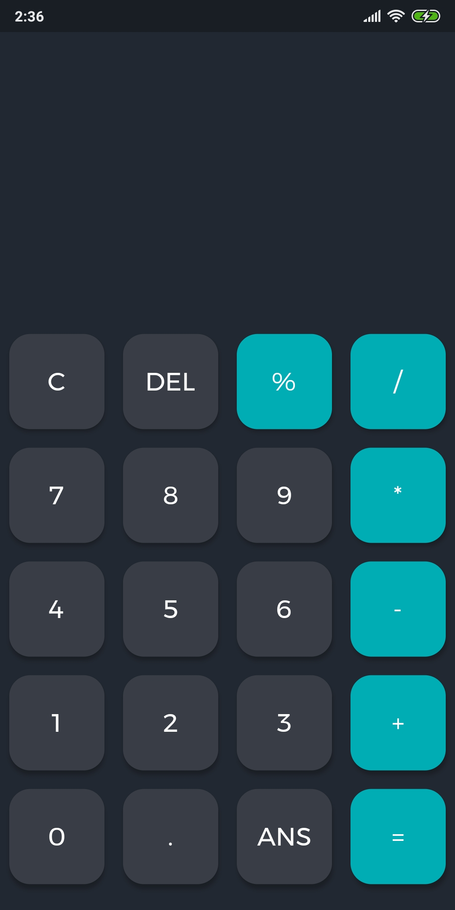
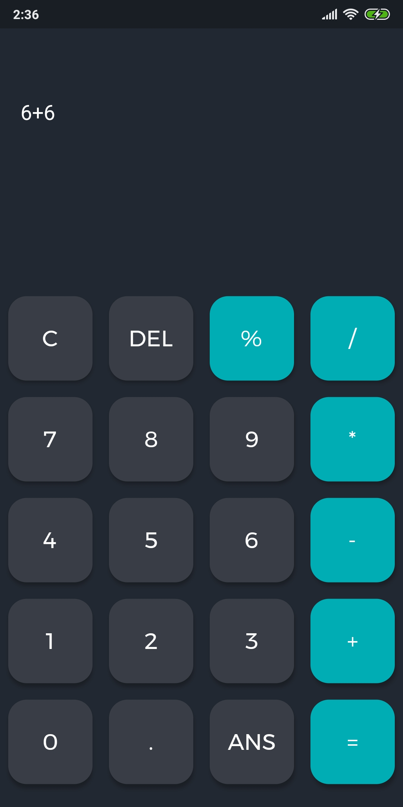
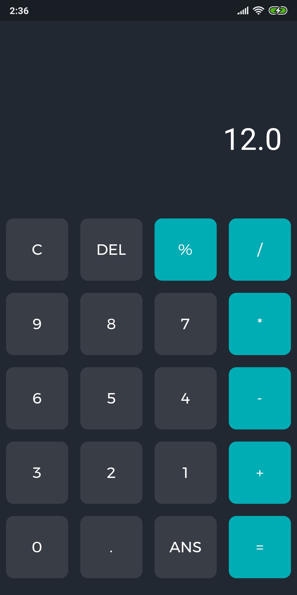

# calculadora
 Calculadora feito em flutter  
 
Cores ultilizadas

 <a href="https://colorhunt.co/palette/2763">ColorHunt</a> 
 Background: #222831 
 Botoões escuros : #393e46 
 Botoes coloridos: #00adb5 
 
Dependências

 google_fonts: ^1.1.1
  
 math_expressions: ^2.0.1
 
  

  
  
  

